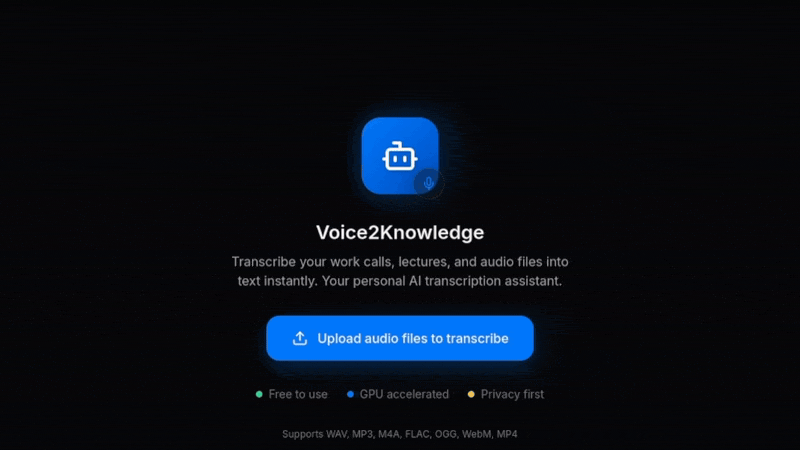

# Voice2Knowledge

A privacy-first local audio transcription and chat tool. All processing happens on your device — your audio never leaves your machine. Ask questions about your transcriptions using a fully local LLM.



---

## Quick Start

### For Regular Users
- Download from Releases (Windows/Mac/Linux)
- Single executable, no installation needed

### For Developers
- Clone repo, then run: `./build.sh` (Linux/macOS) or `build.bat` (Windows)
- Output in dist/Voice2Knowledge/

---

## Download & Install (Regular Users)

### Windows
1. Go to the [Releases page](https://github.com/JKORRA/Voice2Knowledge/releases/latest)
2. Download `Voice2Knowledge-Windows.zip`
3. Extract and run `Voice2Knowledge.exe`

### macOS
1. Go to the [Releases page](https://github.com/JKORRA/Voice2Knowledge/releases/latest)
2. Download `Voice2Knowledge-macOS.zip`
3. Extract the archive
4. Right-click the app and select **Open** (bypasses the security warning on first run)

### Linux
1. Go to the [Releases page](https://github.com/JKORRA/Voice2Knowledge/releases/latest)
2. Download `Voice2Knowledge-Linux.tar.gz`
3. Extract and run: `chmod +x Voice2Knowledge && ./Voice2Knowledge`

---

## Running the Application

### Option A: Desktop App (Recommended)
- Pre-built: Download from Releases
- From source: `python src/launcher.py` (after setup)

### Option B: Web UI (Development Mode)
Two ways to run:
1. **Two-terminal setup:**
   - Terminal 1: `python -m uvicorn backend.main:app --reload --port 8000`
   - Terminal 2: `cd frontend && npm run dev`
   - Open http://localhost:5173

2. **Single command (pywebview):**
   - After setup: `python src/launcher.py`

### Option C: CLI (Lightweight - No UI)
```bash
python script.py "audio.wav" -m small -l it
```
Perfect for batch processing or servers. Full guide in `guide.md`.

---

## Building from Source

### Prerequisites
- Python 3.9+
- Node.js 18+

### Quick Build (Recommended)
```bash
# Linux/macOS
./build.sh

# Windows
build.bat
```
Output: `dist/Voice2Knowledge/`

### Manual Build
```bash
# 1. Create venv
python -m venv venv

# 2. Activate venv
# Linux/macOS
source venv/bin/activate

# Windows (PowerShell)
.\venv\Scripts\Activate.ps1

# Windows (CMD)
.\venv\Scripts\Activate.bat

# 3. Install dependencies
pip install -r requirements.txt

# 4. Build frontend
cd frontend && npm install && npm run build && cd ..

# 5. Package
pip install pyinstaller
pyinstaller app.spec --clean -y
```

---

## Tech Stack

### Backend
- **Framework**: [FastAPI](https://fastapi.tiangolo.com/) + Uvicorn (REST API + WebSocket real-time)
- **Transcription**: [`faster-whisper`](https://github.com/SYSTRAN/faster-whisper) (CTranslate2-optimized Whisper, no PyTorch)
- **Local LLM**: [`llama-cpp-python`](https://github.com/abetlen/llama-cpp-python) (GGUF quantized models)
- **Database**: SQLite (transcription & chat history, no external DB server needed)
- **GPU Detection**: Lightweight probe via ctranslate2 + nvidia-smi fallback (zero torch dependency)
- **Desktop Wrapper**: [pywebview](https://pywebview.flowrl.com/) + PyQt6
- **Export**: TXT, PDF ([fpdf2](https://github.com/andreax79/fpdf2)), DOCX ([python-docx](https://github.com/python-openxml/python-docx))

### Frontend
- **UI**: React 19 + TypeScript 6 + Vite 8
- **Styling**: Tailwind CSS 3
- **State**: Zustand
- **Animation**: framer-motion
- **Icons**: lucide-react

### Models

**Whisper** (transcription, via faster-whisper):

| Size | Default |
|------|---------|
| `tiny`, `base` | |
| `small` | ✅ Default |
| `medium`, `large-v3` | |

**LLM** (chat, via llama.cpp — all GGUF Q4_K_M):

| Model | Size | Default |
|-------|------|---------|
| Qwen 2.5 3B Instruct | ~1.8 GB | ✅ Default |
| Llama 3.2 1B Instruct | ~0.7 GB | |
| Phi 3.5 Mini Instruct | ~2.2 GB | |

### Build
- **Packaging**: PyInstaller (`torch` excluded for smaller bundle, ~200-300 MB)
- **CLI**: Standalone `script.py` for batch processing

---

## Key Features
- **Privacy First**: All local, audio never leaves your device
- **Cross-Platform**: Windows, macOS, Linux
- **GPU Acceleration**: Auto-detects GPU for faster transcription, falls back to CPU
- **History & Export**: TXT, PDF, DOCX export
- **Chat with Transcriptions**: Local LLM integration

---

## Chat with Your Transcriptions

After transcribing audio, you can ask questions about the content — the LLM runs 100% locally, so your data never leaves your machine.

### How It Works

1. **Transcribe** one or more audio files
2. **Select context** — choose which transcriptions to include in the conversation (or use all)
3. **Ask questions** in natural language about the content
4. The LLM answers using **only** the selected transcription context

### Context Selection

When multiple files are transcribed in a session, use the context selector to pick which ones the LLM should reference. This keeps answers focused on the relevant material and avoids mixing unrelated content.

### Available Models

All models are downloaded on demand when first selected. Switch anytime in **Settings** → Chat Model.

| Model | Size | Default |
|-------|------|---------|
| Qwen 2.5 3B Instruct | ~1.8 GB | ✅ Default |
| Llama 3.2 1B Instruct | ~0.7 GB | |
| Phi 3.5 Mini Instruct | ~2.2 GB | |

---

## Project Structure
```
Voice2Knowledge/
├── backend/          # FastAPI backend (audio processing, transcription)
├── frontend/         # React + Vite UI
├── src/              # Core utilities (launcher, models, config)
├── script.py         # Lightweight CLI tool
├── build.sh/.bat    # Build scripts
├── app.spec         # PyInstaller configuration
└── guide.md         # CLI usage guide
```

---

## Troubleshooting

- **GPU not detected**: Falls back to CPU automatically, works fine but slower
- **Port 8000 in use**: Change port: `python -m uvicorn backend.main:app --port 9000`
- **Model download slow**: First run downloads models (~1GB), subsequent runs are faster

---

## License

MIT
